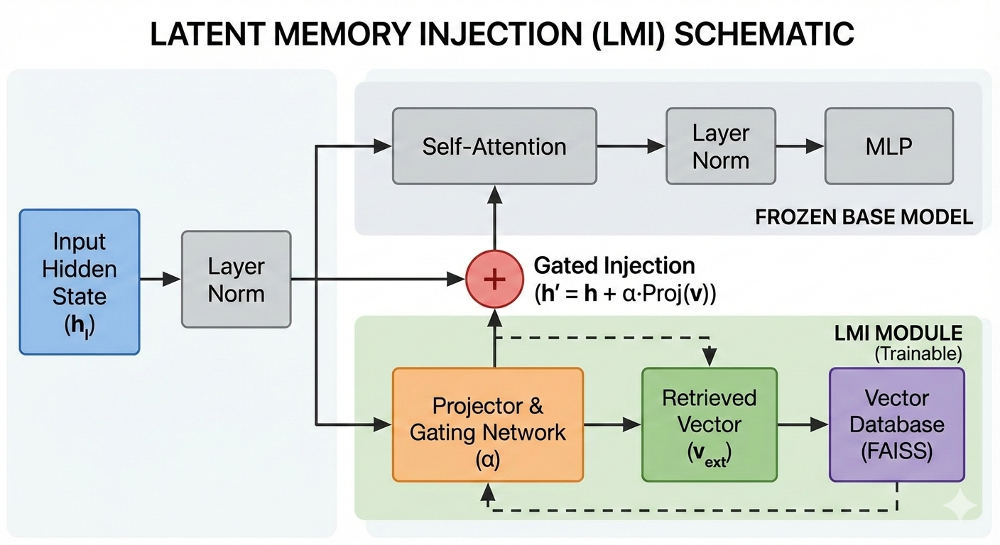
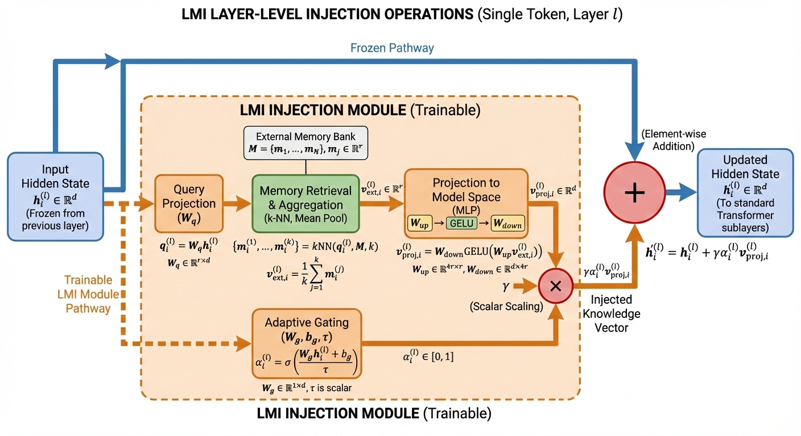
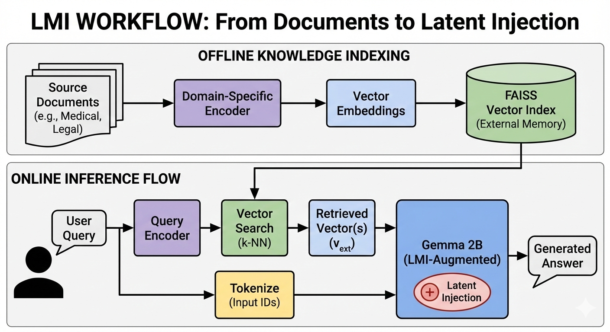

# Latent Memory Injection for Efficient and Modular Knowledge Access in Language Models

## Overview

Latent Memory Injection (LMI) is a novel mechanism for integrating external knowledge into Transformer-based language models without the inefficiencies of traditional token-based retrieval. By injecting retrieved latent vectors directly into hidden states—rather than expanding the token sequence—LMI enables efficient, modular knowledge access while keeping base model parameters frozen.

## Key Features

🔄 Zero-Shot Knowledge Swapping: Switch between knowledge domains (medical, legal, sports) by simply swapping FAISS indices—no model retraining required.

⚡ Computational Efficiency: Fixed sequence length, no quadratic attention overhead from retrieved text.

🎯 Adaptive Gating: Learnable gating mechanism modulates memory injection token-by-token.

🧊 Frozen Base Model: Only lightweight projector, gate, and LoRA parameters are trained.

📊 Multi-Domain Evaluation: Pre-built datasets and knowledge bases for medical, legal, and sports domains.

## Architecture

### Model Schematic

LMI integrates retrieved latent vectors into hidden states before self-attention. The gating scalar 𝛼 controls injection strength dynamically:



Mathematical formulation for a single token:



End-to-End Workflow:




### Repository Structure

```bash
├── data/                           # Domain-specific datasets
│   ├── legal/                      # Legal domain data
│   │   ├── full.jsonl              # Complete dataset
│   │   ├── train.jsonl             # Training split
│   │   ├── val.jsonl               # Validation split
│   │   └── test.jsonl              # Test split
│   ├── medical/                    # Medical domain data
│   └── sports/                     # Sports domain data
├── knowledge/                      # Pre-built knowledge bases
│   ├── legal/                      # Legal FAISS indices & embeddings
│   │   ├── train_index.faiss       # Training index
│   │   ├── train_knowledge.pkl     # Training knowledge embeddings
│   │   ├── val_index.faiss         # Validation index
│   │   ├── val_knowledge.pkl       # Validation knowledge embeddings
│   │   ├── test_index.faiss        # Test index
│   │   └── test_knowledge.pkl      # Test knowledge embeddings
│   ├── medical/                    # Medical knowledge base
│   └── sports/                     # Sports knowledge base
├── gemma/                          # Gemma model implementation
│   ├── config.py                   # Model configuration
│   ├── model.py                    # LMI-augmented model
│   ├── model_vanilla.py            # Baseline vanilla model
│   ├── tokenizer.py                # Tokenizer utilities
│   └── siglip_vision/              # Vision components (if multimodal)
├── scripts/                        # Execution scripts
│   ├── run.py                      # Main training script
│   ├── run_ret.py                  # Retrieval-augmented training
│   ├── inference.py                # Inference script
│   └── testset_inference.py        # Batch inference on test sets
├── results/                        # Experiment results
│   ├── legal.jsonl                 # Legal domain predictions
│   ├── medical.jsonl               # Medical domain predictions
│   └── sports.jsonl                # Sports domain predictions
├── database.py                     # Knowledge base management
├── evaluation.py                   # Evaluation metrics
├── finetune.py                     # Fine-tuning utilities
├── retrieve_metrics.py             # Retrieval quality metrics
├── requirements.txt                # Python dependencies
├── setup.py                        # Package installation
└── tokenizer/                      # Tokenizer files
    ├── gemma3_cleaned_262144_v2.spiece.model
    └── tokenizer.model
```

## Installation

### Prerequisites

Python 3.12 or higher
PyTorch 2.7 or higher (with CUDA if using GPU)
FAISS 1.13 or higher
Sentence Transformers 5.2 or higher

### Setup

Clone the repository:

```bash
git clone https://github.com/yourusername/latent-memory-injection.git
cd latent-memory-injection
```

Create and activate a virtual environment (recommended):

```bash
python -m venv venv
source venv/bin/activate  # On Windows: venv\Scripts\activate
```

Install the required libraries:

```bash
pip install -r requirements.txt
```

### Quick Start

#### Prepare Knowledge Bases

Extract your domain data in a subfolder inside ./data. The knowledge base should contain ONLY FACTS from responses, NO questions.
Example for Legal Domain:

```bash
python database.py \
  --train_data ./data/legal/train.jsonl \
  --val_data ./data/legal/val.jsonl \
  --test_data ./data/legal/test.jsonl \
  --output_dir ./knowledge/legal
```

This creates knowledge embeddings and FAISS indexes in ./knowledge/legal/:

train_knowledge.pkl, train_index.faiss
val_knowledge.pkl, val_index.faiss
test_knowledge.pkl, test_index.faiss

#### Train LMI Components

Fine-tune Gemma with Dynamic V-Matrix Injection. Only trains the injection components (projector, gate, retriever query projection).
Base Gemma model weights remain frozen.

```bash
python finetune.py --model_path path_to_model.ckpt \
                   --knowledge_path path_to_knowledge.pkl \
                   --train_data ./data/legal/train.jsonl \
                   --val_data ./data/legal/val.jsonl \
                   --test_data ./data/legal/test.jsonl \
                   --output_dir ./outputs \
                   --num_epochs 5 \
                   --batch_size 32 \
                   --learning_rate 1e-4 
 ```

#### Demo (Single Inference)

Single query inference for fine-tuned Gemma with Dynamic V-Matrix Injection. Returns response with inference time and VRAM usage.

```bash
python scripts/inference.py --checkpoint path_to_fine_tuned_model.ckpt \
                            --knowledge_path ./knowledge/legal/test_knowledge.pkl \
                            --query "Who is the respondent in the case Union of India vs. Maj. Gen. Manomoy Ganguly?"
```

#### Model Inference on the Test Dataset

Batch inference for fine-tuned Gemma with Dynamic V-Matrix Injection. Reads queries from a JSONL file and saves results to an output JSONL file.

```bash
python scripts/testset_inference.py --checkpoint path_to_fine_tuned_model.ckpt \
                                    --knowledge_path ./knowledge/legal/test_knowledge.pkl \
                                    --input_file ./data/legal/test.jsonl \
                                    --output_file ./results/legal.jsonl
```

#### Evaluation Model

Compute evaluation metrics (Accuracy and F1 Score) uniformly across all domains.

```bash
python evaluation.py \
  --medical_file ./results/medical.jsonl \
  --legal_file ./results/legal.jsonl \
  --sports_file ./results/sports.jsonl \
  --medical_ref ./data/medical/test.jsonl \
  --legal_ref ./data/legal/test.jsonl \
  --sports_ref ./data/sports/test.jsonl \
  --max_samples 100
```

#### Retrieval Metrics

Calculate retrieval metrics including Recall@k and Mean Reciprocal Rank (MRR).

```bash
python retrieve_metrics.py   --test_file ./data/legal/test.jsonl   --knowledge_base ./knowledge/legal/test_knowledge.pkl
```

## Acknowledgments

- Built upon the [Gemma](https://github.com/google/gemma) model architecture
- Uses [FAISS](https://github.com/facebookresearch/faiss) for efficient similarity search
- Inspired by research in retrieval-augmented generation and memory-augmented neural networks
- Thanks to the open-source community for valuable tools and libraries

## Citation

If you use LMI in your research, please cite:

```bibtex
@technicalreport{samani2026lmi,
  title={LMI: Latent Memory Injection for Efficient and Modular Knowledge Access in Language Models},
  author={Asad Samani, Maryam},
  journal={SSRN},
  year={2026},
  url={[https://github.com/yourusername/latent-memory-injection](https://papers.ssrn.com/sol3/papers.cfm?abstract_id=6514258)}
}
```
